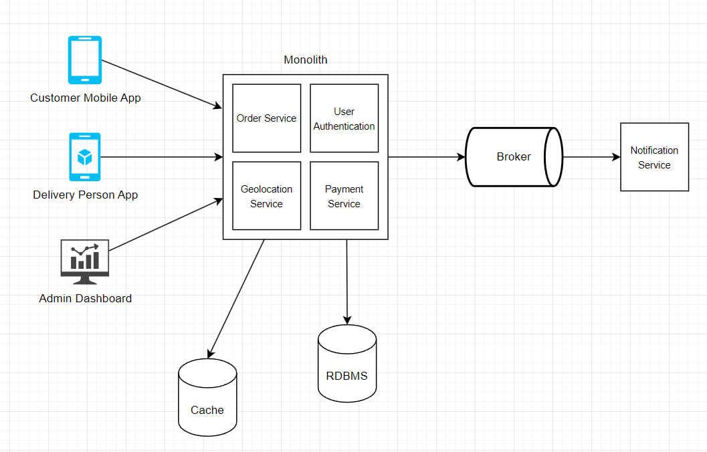

# delivery-app-challenge

A functional prototype of Delivery Application designed for a challenge

## Case

Delivery apps have boomed during this pandemic, and we have a new client that don't want to be left behind in this trend and we plan to launch our own delivery company. For this, we have decided to start with a working prototype, put it to the test for a few months to see if it manages to gain traction and finally, if the test is successful, go all the way to production. The functional prototype, although, it will be basic, must allow customers to place orders and delivery people to do their work.

All the necessary software for this will be developed by us and you will be the Software Engineer in charge of leading the development team. Your team will initially be composed of:

- A Dev designer: Frontend design and development specialist.
- An Impact Lead: In this case, you can consider that it is someone specialized in the business and that will help you so that what you develop has a real impact.
- You, as Software Engineer and project leader.
- You will also have the support of a Data Scientist and a Machine Learning Engineer. They will not participate in the entire process, but you can ask them for help on specific issues.

Next, we would like you to answer a few questions to understand how you would approach the development process. Don't worry if you feel the questions are too open-ended or there isn't enough information to answer them. They are built precisely that way so that you can make all the assumptions you deem appropriate.

## Architecture

